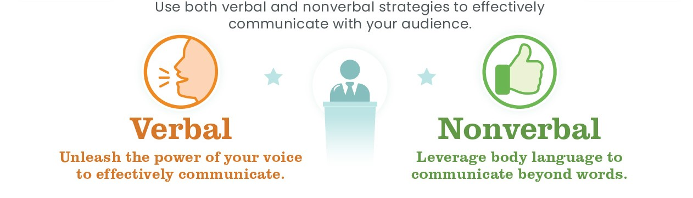

# ePortfolio
Evidence demonstrating each of the learning outcomes for this unit:
1. Explain communication concepts and strategies     
   - Verbal vs Nonverbal Communication
   

2. Show confidence and skills in oral communications and presentations
   - Gave [presentation](Assistive%20Technology.pptx) in person on Assistive technology for the elderly in the context of Finland.
   - Partook in [Facts vs Opinions](A1%20Fact%20Oppinions.docx) activity 

3. Work effectively as part of a team
   - Worked with fellow classmates to complete the [Mob Writing](Week6%20Mob%20Writing.docx) activity

4. Communicate effectively in a professional context
   - Created a [presentation](Assistive%20Technology.pptx) on Assistive technology for the elderly in the context of Finland.
   - Wrote a [research assignment](Research_Task.docx) on the limitation of ring particle accelerators.

5. Define and demonstrate conflict management and resolution strategies.
   - Partook in [Conflict Roleplay](Week5%20Conflict%20Senario.docx) activity
 
